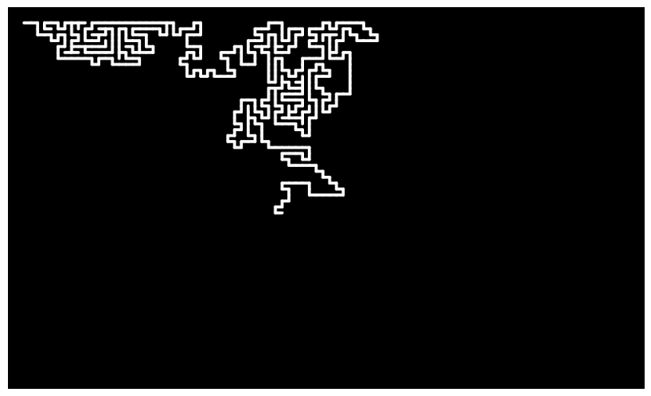

# Maze Generator

Maze Generator is an interactive program built using p5.js that dynamically generates mazes. It's a visually captivating way to explore maze-generation algorithms and see them in action.

## How It Works

Depth-First Search (Recursive Backtracking)

## Screenshots

## Technologies Used

- **Programming Language**: HTML, CSS, JavaScript
- **Library**:  [p5.js](https://p5js.org/) – A JavaScript library for creative coding, perfect for creating interactive visuals and animations.

## Contributing

Contributions are welcome! If you have ideas for new features or improvements, feel free to:

## License

This project is licensed under the [MIT License](LICENSE).

## Contact

For questions or feedback, reach out to [pravats459@gmail.com]().
